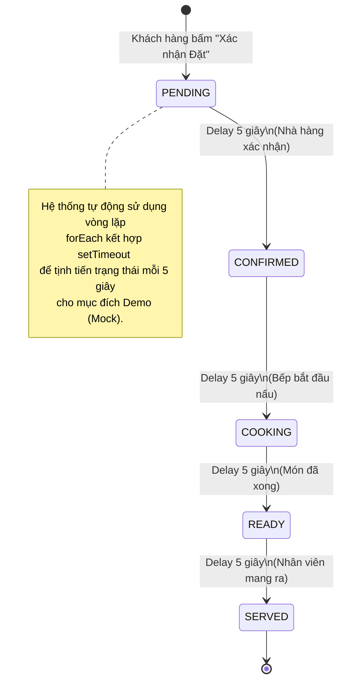
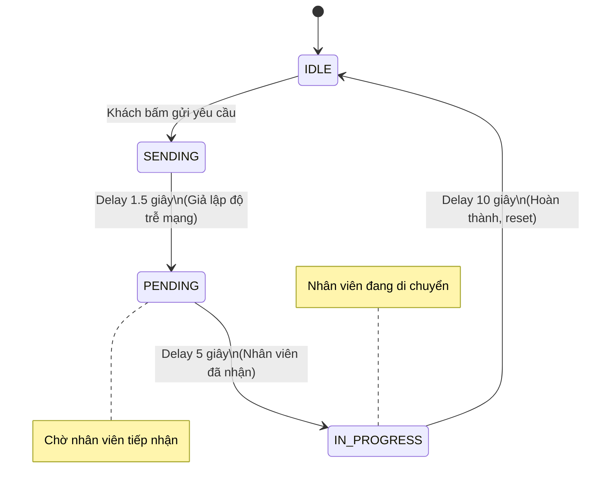

# Order & Support Status State Machines

Mô tả luồng trạng thái (State Flow) được giả lập bên phía Client (`src/app/customer/page.tsx` và `src/app/customer/preview/page.tsx`) thông qua `setTimeout`.

## 1. Vòng đời Đặt món (Order Flow)

## 2. Vòng đời Yêu cầu Hỗ trợ (Support Request Flow)

Lưu ý: Luồng này chạy độc lập cho từng loại yêu cầu (Bát đũa, Khăn giấy, Dọn bàn, Thanh toán).

## ⚠️ Lưu ý Kiến trúc (Architecture Note)

Toàn bộ logic chuyển trạng thái này (State Progression) hiện đang được code "cứng" (Hard-coded) ở tầng Client Component thay vì chạy ngầm (Background Job) bên phía Server API (`/api/orders`). Điều này có nghĩa là nếu khách hàng F5 (Refresh) trang web ngay sau khi đặt hàng, chuỗi `setTimeout` này sẽ bị huỷ (clear) và đơn hàng/yêu cầu có thể kẹt mãi mãi ở trạng thái ban đầu của database.

Đối với môi trường Production, logic này cần được dời xuống Server, kết hợp cùng Database Triggers hoặc Message Queue để đảm bảo tính toàn vẹn dữ liệu.
